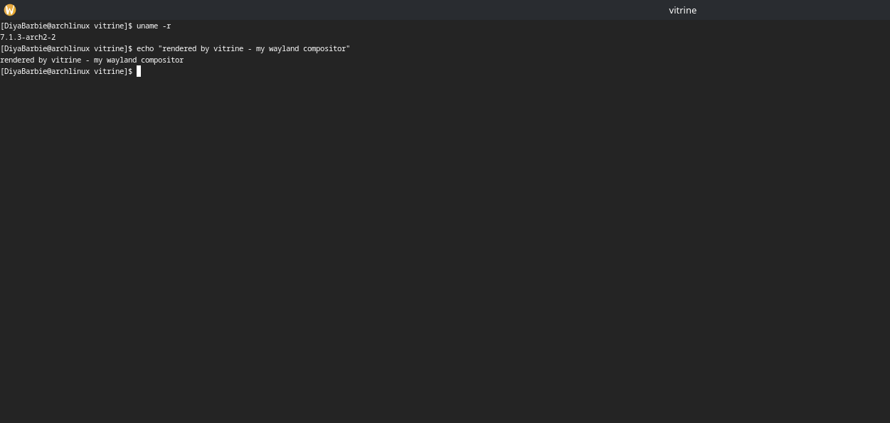

# vitrine


A Wayland **kiosk compositor** in Rust, built on [Smithay](https://github.com/Smithay/smithay).

*Vitrine* (French): a glass display case — which is exactly what a kiosk compositor is.
One screen, one application, nothing else: no desktop, no window chrome, no way for the
user to escape into a shell. The class of display server that drives digital signage,
ticket machines, point-of-sale terminals, and industrial panels.

vitrine boots straight into a single fullscreen Wayland application — on real hardware
via DRM/KMS with no display server underneath, or nested as a window inside an existing
desktop session for development.


*Development mode: vitrine nested as a window, foot running fullscreen inside under
kiosk policy.*

## Design

A kiosk is not a small desktop; it is a different product with different invariants:

- **Every window is fullscreen, always.** Clients are told their size in the initial
  `xdg_toplevel` configure; requests to unfullscreen are politely denied.
- **No interactive move or resize.** The xdg-shell `move`/`resize` requests are
  deliberate no-ops — a fullscreen window has nowhere to go.
- **Focus follows the stacking order, not clicks.** The topmost window owns the
  keyboard, unconditionally. There is no click-to-focus because there is nothing to
  click *between*.
- **The compositor owns the application lifecycle.** It launches the configured app,
  restarts it when it crashes (with a delay, so a crash loop cannot spin), and kills
  it on shutdown — on an unattended device, nobody else is there to.
- **No visible cursor.** Signage and touch kiosks hide it; pointer input still works.

Prior art in this space: [Ubuntu Frame](https://github.com/canonical/ubuntu-frame)
(Mir-based) and [cage](https://github.com/cage-kiosk/cage) (wlroots-based).

## Architecture

```
                 ┌────────────────────────────────────────────┐
                 │                  vitrine                    │
   Wayland       │  ┌──────────┐  ┌─────────┐  ┌───────────┐  │
   clients ──────┼─▶│ protocol │─▶│  space  │─▶│ renderer  │  │
   (socket)      │  │ handlers │  │ (scene) │  │ (GLES2 +  │  │
                 │  │ xdg-shell│  │         │  │  damage)  │  │
                 │  └──────────┘  └─────────┘  └─────┬─────┘  │
                 │        ▲                          │        │
                 │        │ input events             ▼ frames │
                 │  ┌─────┴──────────────────────────────┐    │
                 │  │  backend:  winit (nested, dev)     │    │
                 │  │            udev (DRM/KMS, metal)   │    │
                 │  └────────────────────────────────────┘    │
                 │        watchdog ──▶ the kiosk app          │
                 └────────────────────────────────────────────┘
                       one calloop event loop, single thread
```

What clients see — the full protocol surface, captured from a live client's
`WAYLAND_DEBUG` trace:

```
wl_compositor v5 · wl_subcompositor · xdg_wm_base v6 · wl_shm
zwp_linux_dmabuf_v1 v3 (zero-copy GPU buffers) · wl_seat v9
wl_output v4 · zxdg_output_manager_v1 · wl_data_device_manager
```

## Status

- [x] **Nested compositor** (winit backend): xdg-shell toplevels & popups,
      GLES2 rendering, keyboard/pointer input, kiosk window policy
- [x] **Bare metal** (udev backend): DRM/KMS mode setting, libinput,
      libseat session, VT-switch pause/resume — runs on a TTY with no
      display server underneath (verified on an Intel Iris Xe laptop,
      eDP panel at native mode)
- [x] **Kiosk runtime**: TOML config, app launch + crash watchdog
- [x] **Performance**: damage visualization (`--debug-damage`),
      frame-timing statistics, buffer-age-aware incremental rendering
- [x] **Zero-copy clients**: `linux-dmabuf` global with the renderer's
      real import formats
- [x] **Quality**: CI (fmt, clippy `-D warnings`, build, test); unit tests
      over the policy layer (config, watchdog state machine, stats)

## Running

Nested, inside an existing Wayland session (development):

```bash
cargo run                     # runs the app from vitrine.toml (foot)
cargo run -- -c konsole       # override the app from the CLI
cargo run -- --debug-damage   # tint repainted regions
```

vitrine opens a window that *is* its output; the app launches fullscreen inside
it. Point any other client at the compositor manually — the socket name is
printed at startup:

```bash
WAYLAND_DISPLAY=wayland-1 some-app
```

On bare metal: switch to a free TTY (`Ctrl+Alt+F3`), log in, and run the same
binary — it picks the DRM backend automatically when no display server is
reachable. `Ctrl+Alt+F1..F12` switches VTs, `Ctrl+Alt+Q` quits.

```bash
./target/debug/vitrine --tty
```

To ship a device that boots straight into the kiosk (systemd unit, dedicated
user, two-layer supervision), see [`docs/deploying.md`](docs/deploying.md).

## Configuration

`vitrine.toml` (searched in the working directory, or pass `--config <path>`):

```toml
[app]
command = "foot"          # the application shown fullscreen, forever
args = []
restart = true            # the watchdog: relaunch on exit
restart_delay_ms = 1000   # crash-loop damping
```

Unknown keys are rejected at startup — on an unattended kiosk, a typo'd
config must fail loudly, not silently launch nothing.

## Performance

vitrine renders incrementally: an `OutputDamageTracker` intersects each
swapchain buffer's **age** with accumulated client damage, so only regions
that changed since that buffer was last on screen are repainted. Two tools
make this observable:

- `--debug-damage` — tints every repainted pixel, so you can *watch* damage
  tracking work: type in the kiosk terminal and only the touched character
  cells flash, while the rest of the screen provably isn't redrawn.
- Frame stats, logged every 5 s (`RUST_LOG=info`):

  ```
  frame stats fps=60.0 avg_render_ms=0.36 max_render_ms=0.48 idle_frames=100%
  ```

  `idle_frames` is the share of frames where nothing needed repainting at
  all — for a kiosk showing static content this should sit near 100%, which
  is the difference between a warm and a cool fanless signage box.

  This instrumentation already earned its keep: it exposed the nested
  backend full-repainting every frame (`idle_frames=0%`) because it passed
  buffer age 0; feeding real swapchain age took idle repaints to 100%.

## Future work

Deliberate cut-lines, each with its trade-off understood:

- **Direct scanout** (`DrmCompositor`): put a fullscreen client's dmabuf
  straight on the scanout plane and skip compositing entirely — the ideal
  kiosk fast path. Requires plane format negotiation and a composite
  fallback; `GbmBufferedSurface` (always composite) was the right first rung.
- **Idle flip-skipping**: on `idle_frames`, skip the page flip too and wake
  only on new damage — takes idle GPU cost to zero, but rendering must be
  re-armed on the first damaging commit.
- **Headless protocol tests**: a real Wayland client asserting on configure
  events against a headless vitrine in CI — the next tier above the current
  policy-layer unit tests.
- **Hardware cursor plane**: irrelevant while the kiosk hides the cursor,
  needed the day it doesn't.
- **Compositor introspection protocol**: a custom Wayland extension (XML
  spec + generated bindings) exposing scene and frame-timing state to a CLI
  client — protocol design, not just protocol implementation.
- **Snap packaging**: how Ubuntu Frame ships; would make the deployment
  story one `snap install`.

## Study notes

This project is also a learning log of the Linux graphics stack. Each
checkpoint has a write-up in [`notes/`](notes/) covering the concepts it
introduced, with links to specs and docs:

1. [Anatomy of a Wayland compositor](notes/01-anatomy-of-a-wayland-compositor.md)
2. [Bare metal: DRM/KMS, libinput, libseat](notes/02-bare-metal-drm-kms.md)
3. [Damage tracking, buffer age, frame timing](notes/03-damage-and-frame-timing.md)

## License

MIT
